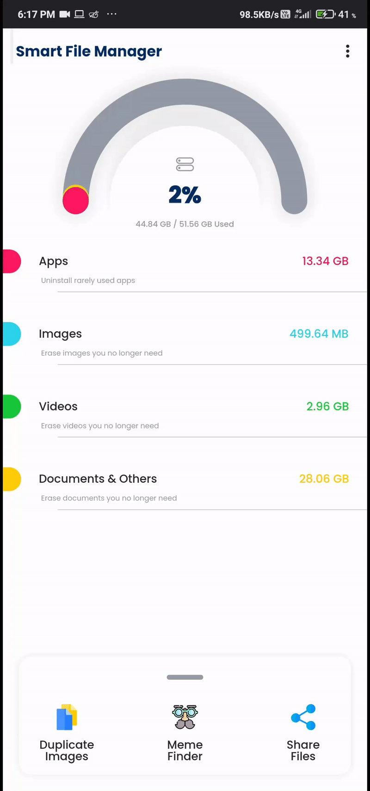

<div align="center"> 
    
    <h2 align="center"><b>Smart File Manager</b></h2>
    <h3 align="center">
        A Smart application to manage your files in your device
    </h3>
</div>

---

<div><br></div>

## Table of Contents
1.  About
1.  Built With
1.  Screenshots
1.  How can you use it ?
    - Prerequisites
    - Usage
1. Contact


# About
#### This is my B.E Final Year Project, which serves the purpose of File Manager with some other features helping user to keep his device bloatfree and perform to it's optimum performance all time. The application has features like
-   File Manager
-   Near & Exact Duplicate Images
-   Meme Classifier
-   File Sharing

## Pending from our side
-   The File sharing feature is still yet to be implemented
-   The whole project will be ported to Dart's 'Sound Null-Safety' very soon

<div><br><br></div>

# Built With
#### This application is built using Flutter,Dart and TensorflowLite Model.

<div align="center" display="block">
<br>


</div>

<br><br></div>

# Screenshots
### Here are the App Screenshots
-   Home Screen
<br><br>

<br><br>

### If you want the multiprogress bar widget to be implemented in your project, here I've created a package of it for you !

Package Link - [Multi Progress Bar](https://pub.dev/packages/multi_circular_slider)

<br>

-   File Manager
<br><br>

<br><br>

-   Duplicate Image Finder
<br><br>

<br><br>

-   Meme Classifier
<br><br>

<br><br>

# How can you use it ?
#### You need to follow this simple steps to execute this application locally on your machine

## Prerequisites
1. Flutter SDK must be installed -> [How to do it ?](https://flutter.dev/docs/get-started/install)
1. Basic knowledge of Flutter & Android


## Usage
1. Clone the project by command
    ```
        git clone https://github.com/mayurnile/smart_file_manager
    ```
1.  Execute the app!

<div><br><br></div>

# Contact
Mayur Nile - [Linkedin](https://www.linkedin.com/in/mayurnile/) - mayurnile95@gmail.com

Project Link: [https://github.com/mayurnile/my_notes](https://github.com/mayurnile/smart_file_manager)